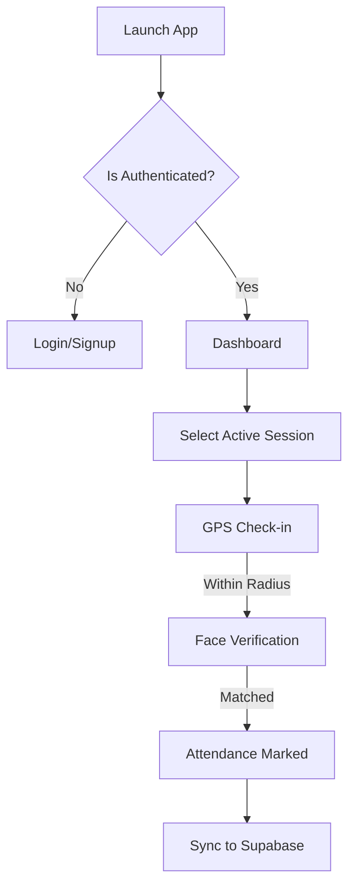

# UniAttend - Smart Biometric Attendance System


UniAttend is a state-of-the-art mobile application built with Flutter that revolutionizes the way university attendance is recorded. By combining **Artificial Intelligence (AI)**, **Biometrics**, and **Geofencing**, UniAttend provides a secure, automated, and tamper-proof solution for both students and faculty.

## 🚀 Key Features

### 🔐 Advanced Biometric Security
*   **Real-time Face Detection**: Uses Google ML Kit to detect and align faces in the camera stream.
*   **AI-Powered Recognition**: Leverages a **MobileFaceNet TFLite model** to generate unique 192-dimensional embeddings for every student.
*   **Anti-Spoofing (Liveness Detection)**: Prevents the use of photos or pre-recorded videos through active blink and head-movement (yaw) detection.
*   **Multi-Sample Enrollment**: Captures 3 distinct samples of a student's face during registration to ensure maximum accuracy and reliability.

### 📍 Precise Geofencing
*   **Location-Based Check-in**: Students must be within a pre-defined university radius (e.g., 100 meters) to mark their attendance.
*   **Live Map Visualization**: Displays the university boundary and the student's live location on an interactive map.

### 📱 Smart Workflows
*   **Intuitive Student Dashboard**: Real-time attendance statistics, schedule tracking, and automated alerts for missing classes.
*   **Comprehensive Teacher Flow**: Manage multiple courses, view live attendance counts, and perform manual overrides if necessary.
*   **Real-time Synchronization**: Powered by Supabase for instantaneous data updates across all devices.

---

## 🛠️ Technical Stack

*   **Frontend**: [Flutter](https://flutter.dev/) & [Dart](https://dart.dev/)
*   **State Management**: [GetX](https://pub.dev/packages/get)
*   **Backend & DB**: [Supabase](https://supabase.com/) (PostgreSQL + Auth)
*   **AI Engine**: [TFLite](https://www.tensorflow.org/lite) + [Google ML Kit](https://developers.google.com/ml-kit)
*   **Key Packages**: `camera`, `geolocator`, `google_maps_flutter`, `tflite_flutter`, `image`

---

## 📐 Architecture & Logic

### Face Recognition Pipeline
1.  **Detection**: ML Kit identifies the face and ensures it is aligned within the UI oval.
2.  **Liveness Verification**: The user must blink or move their head to confirm they are a real person.
3.  **Embedding Generation**: The live face is cropped, normalized, and processed by the AI model.
4.  **Multi-Dimensional Comparison**: Live embeddings are compared against stored templates using **Cosine Similarity**.
5.  **Validation Rule**: A match is only confirmed after **3 consecutive successful frames** (Threshold >= 0.75).

### Attendance Flow


---

## 📂 Database Schema Overview

*   **`students`**: Personal details, Roll No, and `face_data` (JSONB containing templates).
*   **`teachers`**: Faculty information and assigned departments.
*   **`courses`**: Course codes, names, and faculty assignments.
*   **`class_sessions`**: Schedule data, room assignments, and session dates.
*   **`attendance`**: Record of ID, status, location coordinates, and timestamps.
*   **`coordinates`**: Defines the university boundary (Lat/Long/Radius).

---

## ⚙️ Installation & Setup

1.  **Clone the Repository**:
    ```bash
    git clone https://github.com/m-ahmed-codes/attendance-systems.git
    cd attendance-systems/uni_attend
    ```
2.  **Add Assets**:
    *   Place your `mobilefacenet.tflite` in `assets/models/`.
    *   Ensure your `supabase_service.dart` is configured with your API credentials.
3.  **Run the App**:
    ```bash
    flutter clean
    flutter pub get
    flutter run
    ```

---

## 📝 License
This project is for educational and institutional use. All biometric data is stored securely and encrypted within the Supabase infrastructure.

*Developed by [M. Ahmed](https://github.com/m-ahmed-codes)*
